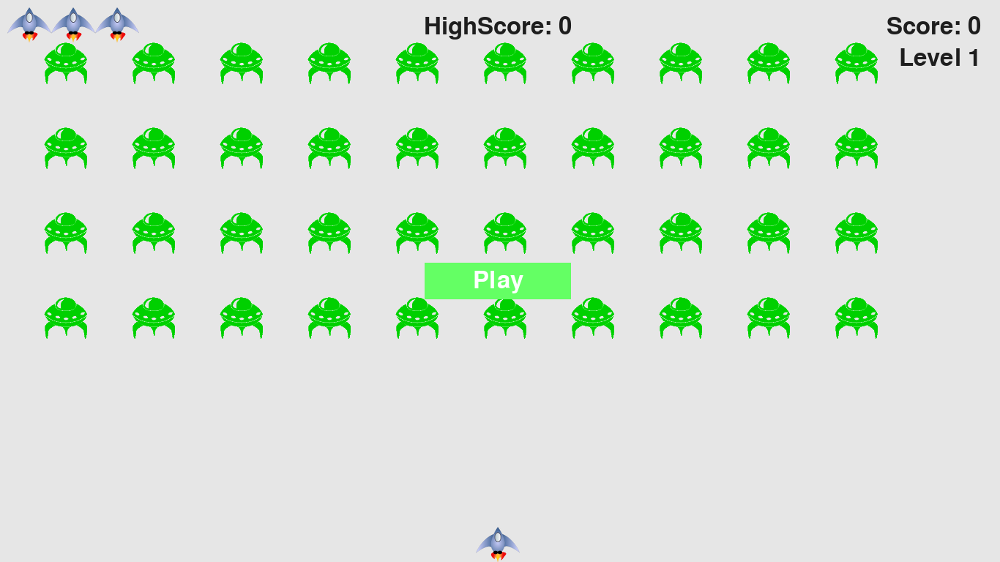

# ALIEN INVASION GAME IN PYTHON DOCUMENTATION
**This is a python project tutorial using pygame**

**Pre-Requisites**
To work on this project, you'll need:
- Basic understanding Python3 syntax
- Solid grasp on Classes in python
- Solid graps of Functions in python
- Installed Pygame
That's it
---

---
To access the Full project source code and files, visit the repo on [Github]().
---
##  Pygame
Pygame is a collection of powerful python modules that manage animations, graphics and even sound, to build powerful applications, like games etc
---
###  INSTALLING PYGAME
To install pygame in your computer, open the terminal and run the command
`python3 -m pip install pygame`

Once pygame is installed, you can now start using it in your programs, by importing it.
`import pygame`

**Now we're good to go**

**Project Definition**
***In Alien Invasion, the player controls a rocket ship that appears***
***at the bottom center of the screen. The player can move the ship***
***right and left using the arrow keys and shoot bullets using the***
***spacebar. When the game begins, a fleet of aliens fills the sky***
***and moves across and down the screen. The player shoots and***
***destroys the aliens. If the player shoots all the aliens, a new fleet***
***appears that moves faster than the previous fleet. If any alien hits***
***the player’s ship or reaches the bottom of the screen, the player***
***loses a ship. If the player loses three ships, the game ends.***

##  Starting the Game Project
We’ll begin building the game by creating an empty Pygame window. Later,
we’ll draw the game elements, such as the ship and the aliens, on this win­
dow. We’ll also make our game respond to user input, set the background
color, and load a ship image.

### Creating a Pygame Window and Responding to User Input
We’ll make an empty Pygame window by creating a class to represent the
game

```python
import sys

import pygame

class AlienInvasion:

    """Overall class to manage game assets and behavior."""

    def __init__(self):

        """Initialize the game, and create game resources."""

        pygame.init()

        self.screen = pygame.display.set_mode((1200, 800))  # Attribute representing the game window

        pygame.display.set_caption("Alien Invasion")

    def run_game(self):

        """Start the main loop for the game."""

        while True:

            # Watch for keyboard and mouse events.

            for event in pygame.event.get():

                if event.type == pygame.QUIT:

                sys.exit()

            # Make the most recently drawn screen visible.

            pygame.display.flip()

if __name__ == '__main__':

    # Make a game instance, and run the game.

    ai = AlienInvasion()

    ai.run_game()
```

First, we import the sys and pygame modules. 
The pygame module con­tains the functionality we need to make a game. The sys module contains tools to exit the game when the player quits.
Alien Invasion starts as a class called AlienInvasion. In the __init__()
method, the pygame.init() function initializes the background settings that
Pygame needs to work properly. Then we call pygame.display.set_mode() to
create a display window, on which we’ll draw all the game’s graphical ele­ments. The argument (1200, 800) is a tuple that defines the dimensions of
the game window, which will be 1200 pixels wide by 800 pixels high. (You
can adjust these values depending on your display size.) We assign this dis­
play window to the attribute self.screen, so it will be available in all methods
in the class.

The object we assigned to self.screen is called a surface. A surface in
Pygame is a part of the screen where a game element can be displayed.
Each element in the game, like an alien or a ship, is its own surface. The
surface returned by display.set_mode() represents the entire game window.
When we activate the game’s animation loop, this surface will be redrawn
on every pass through the loop, so it can be updated with any changes trig­
gered by user input.

The game is controlled by the run_game() method. This method contains
a while loop that runs continually. The while loop contains an event loop
and code that manages screen updates. An event is an action that the user
performs while playing the game, such as pressing a key or moving the
mouse. To make our program respond to events, we write this event loop to
listen for events and perform appropriate tasks depending on the kinds of
events that occur. The for loop at line (76) is an event loop.
To access the events that Pygame detects, we’ll use the pygame.event.get() function. This function returns a list of events that have taken place
since the last time this function was called. Any keyboard or mouse event
will cause this for loop to run. Inside the loop, we’ll write a series of if
statements to detect and respond to specific events. For example, when the
player clicks the game window’s close button, a pygame.QUIT event is detected
and we call sys.exit() to exit the game.

The call to pygame.display.flip() tells Pygame to make the most
recently drawn screen visible. In this case, it simply draws an empty screen
on each pass through the while loop, erasing the old screen so only the new
screen is visible. When we move the game elements around, pygame.display.flip() continually updates the display to show the new positions of game
elements and hides the old ones, creating the illusion of smooth movement.

At the end of the file, we create an instance of the game, and then call
run_game(). We place run_game() in an if block that only runs if the file is
called directly. When you run this alien_invasion.py file, you should see an
empty Pygame window.

### Setting the background Color
Pygame creates a black screen by default. We can set a differ­ent background color. We’ll do this at the end of the __init__() method.
```python
def __init__(self):
    --snip--
    pygame.display.set_caption("Alien Invasion")
    # Set the background color.
    self.bg_color = (230, 230, 230)

def run_game(self):
    --snip--
    for event in pygame.event.get():
        if event.type == pygame.QUIT:
        sys.exit()
    # Redraw the screen during each pass through the loop.
    self.screen.fill(self.bg_color)
```
Colors in Pygame are specified as RGB colors: a mix of red, green,
and blue. Each color value can range from 0 to 255. The color value (255,
0, 0) is red, (0, 255, 0) is green, and (0, 0, 255) is blue. You can mix differ­
ent RGB values to create up to 16 million colors. The color value (230, 230,
230) mixes equal amounts of red, blue, and green, which produces a light
gray background color. We assign this color to self.bg_color at line (146).
At line (154), we fill the screen with the background color using the fill()
method, which acts on a surface and takes only one argument: a color.

### Creating a settings class
Each time we introduce new functionality into the game, we’ll typically
create some new settings as well. Instead of adding settings throughout
the code, let’s write a module called settings that contains a class called
Settings to store all these values in one place. This approach allows us to
work with just one settings object any time we need to access an individual
setting. This also makes it easier to modify the game’s appearance and
behavior as our project grows: to modify the game, we’ll simply change
some values in settings.py, which we’ll create next, instead of searching for
different settings throughout the project.

```python
class Settings:

"""A class to store all settings for Alien Invasion."""

    def __init__(self):

        """Initialize the game's settings."""

        # Screen settings

        self.screen_width = 1200

        self.screen_height = 800

        self.bg_color = (230, 230, 230)

```
Then we'll need to make an instance of Settings in the project and use it to access our settings, by modifying alien_invasion.py as follows:

```python
# AlienInvasion.py 
import pygame

from settings import Settings

class AlienInvasion:

    """Overall class to manage game assets and behavior."""

    def __init__(self):

        """Initialize the game, and create game resources."""

        pygame.init()

        self.settings = Settings()

        self.screen = pygame.display.set_mode((self.settings.screen_width, 
        self.settings.screen_height))

        pygame.display.set_caption("Alien Invasion")

    def run_game(self):
        
        --snip--
        # Redraw the screen during each pass through the loop.

        self.screen.fill(self.settings.bg_color)

        # Make the most recently drawn screen visible.

        pygame.display.flip()
```
We import Settings into the main program file. Then we create an
instance of Settings and assign it to self.settings at line (212), after making the call to pygame.init(). When we create a screen, we use the screen_width and
screen_height attributes of self.settings, and then we use self.settings to
access the background color when filling the screen as well.
When you run alien_invasion.py now you won’t yet see any changes,
because all we’ve done is move the settings we were already using else­
where. Now we’re ready to start adding new elements to the screen.

### Adding the Ship Image
Let’s add the ship to our game. To draw the player’s ship on the screen,
we’ll load an image and then use the Pygame blit() method to draw the
image.

You can find the ship.bmp image file in the  folder

### Creating the Ship class
After choosing an image for the ship, we need to display it on the screen. To
use our ship, we’ll create a new ship module that will contain the class Ship.
This class will manage most of the behavior of the player’s ship:

```python
#ship.py
import pygame

class Ship:
    """A class to manage the ship."""

    def __init__(self, ai_game):

        """Initialize the ship and set its starting position."""

        self.screen = ai_game.screen

        self.screen_rect = ai_game.screen.get_rect()

        # Load the ship image and get its rect.

        self.image = pygame.image.load('images/ship.bmp')

        self.rect = self.image.get_rect()

        # Start each new ship at the bottom center of the screen.

        self.rect.midbottom = self.screen_rect.midbottom

    def blitme(self):

        """Draw the ship at its current location."""

        self.screen.blit(self.image, self.rect)

```

Pygame is efficient because it lets you treat all elements like rect­angles (rects), even if they’re not exactly shaped like rectangles. Treating an element as a rectangle is efficient because rectangles are simple geo­metric shapes. When Pygame needs to figure out whether two ele­ments have collided, for example, it can do this more quickly if it treats each object as a rectangle. This approach usually works well enough that no one playing the game will notice that we’re not working with the exact shape of each game element. We’ll treat the ship and the screen as rect­angles in this class.

We import the pygame module before defining the class. The __init__()
method of Ship takes two parameters: the self reference and a reference to
the current instance of the AlienInvasion class. This will give Ship access to
all the game resources defined in AlienInvasion. At line(261) we assign the screen
to an attribute of Ship, so we can access it easily in all the methods in this
class. At line(263) we access the screen’s rect attribute using the get_rect() method and assign it to self.screen_rect. Doing so allows us to place the ship in the correct location on the screen. To load the image, we call pygame.image.load() and give it the loca­tion of our ship image. This function returns a surface representing the ship, which we assign to self.image. When the image is loaded, we call get_rect() to access the ship surface’s rect attribute so we can later use it to place the ship.

When you’re working with a rect object, you can use the x- and y-coordi­nates of the top, bottom, left, and right edges of the rectangle, as well as the
center, to place the object. You can set any of these values to establish the
current position of the rect. When you’re centering a game element, work
with the center, centerx, or centery attributes of a rect. When you’re working
at an edge of the screen, work with the top, bottom, left, or right attributes.
There are also attributes that combine these properties, such as midbottom,
midtop, midleft, and midright. When you’re adjusting the horizontal or verti­
cal placement of the rect, you can just use the x and y attributes, which are
the x- and y-coordinates of its top-left corner.

***Note***
*In Pygame, the origin (0, 0) is at the top-left corner of the screen and* *coordinates increase as you go down and to the right. On a 1200 by 800 screen* *the origin is at the top-left corner, and the bottom-right corner has the* *coordinates (1200, 800).*
***These coordinates refer to the game window, not the physical screen.***

We’ll position the ship at the bottom center of the screen. To do so,
make the value of self.rect.midbottom match the midbottom attribute of the
screen’s rect. Pygame uses these rect attributes to position the ship
image so it’s centered horizontally and aligned with the bottom of the
screen.
At line(275), we define the blitme() method, which draws the image to the
screen at the position specified by self.rect.

####    Drawing the Ship to the Screen
Now let’s update alien_invasion.py so it creates a ship and calls the ship’s
blitme() method:

```python
#Alien_invasion.py
--snip--

from settings import Settings

from ship import Ship

class AlienInvasion:
    """Overall class to manage game assets and behavior."""

    def __init__(self):
            
        --snip--

        pygame.display.set_caption("Alien Invasion")

        self.ship = Ship(self)

    def run_game(self):

        --snip--

        # Redraw the screen during each pass through the loop.

        self.screen.fill(self.settings.bg_color)

        self.ship.blitme()

        # Make the most recently drawn screen visible.

        pygame.display.flip()

        --snip--
```

We import Ship and then make an instance of Ship after the screen
has been created. The call to Ship() requires one argument, an instance
of AlienInvasion. The self argument here refers to the current instance of
AlienInvasion. This is the parameter that gives Ship access to the game’s
resources, such as the screen object. We assign this Ship instance to
self.ship.
After filling the background, we draw the ship on the screen by calling
ship.blitme(), so the ship appears on top of the background.
When you run alien_invasion.py now, you should see an empty game
screen with the rocket ship sitting at the bottom center

###    Refactoring Our Code
Refactoring simplifies the structure of the code you’ve already
written, making it easier to build on. In this section, we’ll break the run_game()
method, which is getting lengthy, into two helper methods. A helper method
does work inside a class but isn’t meant to be called through an instance. In
Python, a single leading underscore indicates a helper method.

####    The _check_events() Method
We’ll move the code that manages events to a separate method called
_check_events(). This will simplify run_game() and isolate the event manage­
ment loop. Isolating the event loop allows you to manage events separately
from other aspects of the game, such as updating the screen.
Here’s the AlienInvasion class with the new _check_events() method,
which only affects the code in run_game():

```python
#Alien_invasion.py

def run_game(self):

    """Start the main loop for the game."""

    while True:

        self._check_events()# Redraw the screen during each pass through the loop.

        --snip--

def _check_events(self):

    """Respond to keypresses and mouse events."""

    for event in pygame.event.get():

        if event.type == pygame.QUIT:

        sys.exit()
```

####    The _update_screen() Method
To further simplify run_game(), we’ll move the code for updating the screen
to a separate method called _update_screen():
```python
#Alien_invasion.py
def run_game(self):

    """Start the main loop for the game."""

    while True:

        self._check_events()

        self._update_screen()

def _check_events(self):

    --snip--

def _update_screen(self):

    """Update images on the screen, and flip to the new screen."""

    self.screen.fill(self.settings.bg_color)

    self.ship.blitme()

    pygame.display.flip()
```

### Piloting The Ship

Next, we’ll give the player the ability to move the ship right and left. We’ll
write code that responds when the player presses the right or left arrow key.
We’ll focus on movement to the right first, and then we’ll apply the same prin­
ciples to control movement to the left. As we add this code, you’ll learn how to
control the movement of images on the screen and respond to user input.

####    Responding to a Keypress
Whenever the player presses a key, that keypress is registered in Pygame as
an event. Each event is picked up by the pygame.event.get() method. We need
to specify in our _check_events() method what kind of events we want the
game to check for. Each keypress is registered as a KEYDOWN event.
When Pygame detects a KEYDOWN event, we need to check whether the
key that was pressed is one that triggers a certain action. For example, if the
player presses the right arrow key, we want to increase the ship’s rect.x value
to move the ship to the right:

~~~python
#Alien_invasion.py

def _check_events(self):
    """Respond to keypresses and mouse events."""

    for event in pygame.event.get():

        if event.type == pygame.QUIT:

            sys.exit()

        elif event.type == pygame.KEYDOWN:

            if event.key == pygame.K_RIGHT:

            # Move the ship to the right.

            self.ship.rect.x += 1
~~~

Inside _check_events() we add an elif block to the event loop to respond
when Pygame detects a KEYDOWN event. We check whether the key pressed,
event.key, is the right arrow key. The right arrow key is represented by
pygame.K_RIGHT. If the right arrow key was pressed, we move the ship to the
right by increasing the value of self.ship.rect.x by 1.
When you run alien_invasion.py now, the ship should move to the right
one pixel every time you press the right arrow key. That’s a start, but it’s not
an efficient way to control the ship. Let’s improve this control by allowing
continuous movement.

#### Allowing Continuous Movement

When the player holds down the right arrow key, we want the ship to
continue moving right until the player releases the key. We’ll have the
game detect a pygame.KEYUP event so we’ll know when the right arrow key is
released; then we’ll use the KEYDOWN and KEYUP events together with a flag
called moving_right to implement continuous motion.

When the moving_right flag is False, the ship will be motionless. When
the player presses the right arrow key, we’ll set the flag to True, and when the
player releases the key, we’ll set the flag to False again.
The Ship class controls all attributes of the ship, so we’ll give it an attri-
bute called moving_right and an update() method to check the status of the
moving_right flag. The update() method will change the position of the ship if
the flag is set to True. We’ll call this method once on each pass through the
while loop to update the position of the ship.
Here are the changes to Ship:

```python
ship.py
class Ship:
"""A class to manage the ship."""
    def __init__(self, ai_game):

        --snip--

        # Start each new ship at the bottom center of the screen.

        self.rect.midbottom = self.screen_rect.midbottom

        # Movement flag

        self.moving_right = False
        
    def update(self):

        """Update the ship's position based on the movement flag."""

        if self.moving_right:

            self.rect.x += 1

    def blitme(self):

        --snip--
```

We add a self.moving_right attribute in the __init__() method and set it
to False initially.
Then we add update(), which moves the ship right if the
flag is True.
The update() method will be called through an instance of
Ship, so it’s not considered a helper method.

Now we need to modify _check_events() so that moving_right is set to True
when the right arrow key is pressed and False when the key is released:
```python
#Alien_invasion.py

def _check_events(self):

    """Respond to keypresses and mouse events."""

    for event in pygame.event.get():

        --snip--

    elif event.type == pygame.KEYDOWN:

        if event.key == pygame.K_RIGHT:

            self.ship.moving_right = True

    elif event.type == pygame.KEYUP:

        if event.key == pygame.K_RIGHT:

            self.ship.moving_right = False

```
we modify how the game responds when the player presses the
right arrow key: instead of changing the ship’s position directly, we merely
set moving_right to True. Then we add a new elif block at line (556), which responds to KEYUP events. When the player releases the right arrow key (K_RIGHT), we set moving_right to False.

Next, we modify the while loop in run_game() so it calls the ship’s update()
method on each pass through the loop:
```python
#Alien_invasion.py
def run_game(self):

    """Start the main loop for the game."""

    while True:

        self._check_events()

        self.ship.update()

        self._update_screen()

```

The ship’s position will be updated after we’ve checked for keyboard
events and before we update the screen. This allows the ship’s position to be
updated in response to player input and ensures the updated position will
be used when drawing the ship to the screen.

When you run alien_invasion.py and hold down the right arrow key, the
ship should move continuously to the right until you release the key.


####    Moving Both Left and Right
Now that the ship can move continuously to the right, adding movement to
the left is straightforward. Again, we’ll modify the Ship class and the _check
_events() method. Here are the relevant changes to __init__() and update()
in Ship:

```python
ship.py
def __init__(self, ai_game):

    --snip--

    # Movement flags

    self.moving_right = False

    self.moving_left = False

def update(self):

    """Update the ship's position based on movement flags."""

    if self.moving_right:

        self.rect.x += 1

    if self.moving_left:

        self.rect.x -= 1
```

In __init__(), we add a self.moving_left flag. In update(), we use two
separate if blocks rather than an elif to allow the ship’s rect.x value to be
increased and then decreased when both arrow keys are held down. This
results in the ship standing still. If we used elif for motion to the left, the right arrow key would always have priority. Doing it this way makes the
movements more accurate when switching from right to left when the player
might momentarily hold down both keys.

We have to make two adjustments to _check_events():
```python
#Alien_invasion.py

def _check_events(self):

    """Respond to keypresses and mouse events."""

    for event in pygame.event.get():

        --snip--

        elif event.type == pygame.KEYDOWN:

            if event.key == pygame.K_RIGHT:

                self.ship.moving_right = True

            elif event.key == pygame.K_LEFT:

                self.ship.moving_left = True

        elif event.type == pygame.KEYUP:

            if event.key == pygame.K_RIGHT:

                self.ship.moving_right = False

            elif event.key == pygame.K_LEFT:

                self.ship.moving_left = False

```

If a KEYDOWN event occurs for the K_LEFT key, we set moving_left to True. If a
KEYUP event occurs for the K_LEFT key, we set moving_left to False. We can use
elif blocks here because each event is connected to only one key. If the player
presses both keys at once, two separate events will be detected.

When you run alien_invasion.py now, you should be able to move the ship
continuously to the right and left. If you hold down both keys, the ship should
stop moving.

Next, we’ll further refine the ship’s movement. Let’s adjust the ship’s
speed and limit how far the ship can move so it can’t disappear off the sides
of the screen.

####    Adjusting the Ship’s Speed
Currently, the ship moves one pixel per cycle through the while loop, but we
can take finer control of the ship’s speed by adding a ship_speed attribute to
the Settings class. We’ll use this attribute to determine how far to move the
ship on each pass through the loop.

```python
#Settings.py
class Settings:

    """A class to store all settings for Alien Invasion."""

    def __init__(self):

        --snip--

        # Ship settings
        
        self.ship_speed = 1.5
```
We set the initial value of ship_speed to 1.5. When the ship moves
now, its position is adjusted by 1.5 pixels rather than 1 pixel on each pass
through the loop.

However, rect attributes such as x store only integer values, so we need to
make some modifications to Ship:
```python
#ship.py

class Ship:

    """A class to manage the ship."""
    
    def __init__(self, ai_game):

        """Initialize the ship and set its starting position."""
        
        self.screen = ai_game.screen

        self.settings = ai_game.settings

        --snip--

        # Start each new ship at the bottom center of the screen.

        --snip--

        # Store a decimal value for the ship's horizontal position.

        self.x = float(self.rect.x)

        # Movement flags

        self.moving_right = False

        self.moving_left = False

    def update(self):

        """Update the ship's position based on movement flags."""

        # Update the ship's x value, not the rect.

        if self.moving_right:
            
            self.x += self.settings.ship_speed

        if self.moving_left:

            self.x -= self.settings.ship_speed

        # Update rect object from self.x.

        self.rect.x = self.x

    def blitme(self):

    --snip--
```
We create a settings attribute for Ship, so we can use it in update().
Because we’re adjusting the position of the ship by fractions of a pixel, we
need to assign the position to a variable that can store a decimal value. You
can use a decimal value to set an attribute of rect, but the rect will only
keep the integer portion of that value. To keep track of the ship’s position
accurately, we define a new self.x attribute that can hold decimal values .
We use the float() function to convert the value of self.rect.x to a decimal
and assign this value to self.x.
Now when we change the ship’s position in update(), the value of self.x
is adjusted by the amount stored in settings.ship_speed. After self.x has
been updated, we use the new value to update self.rect.x, which controls
the position of the ship. Only the integer portion of self.x will be stored
in self.rect.x, but that’s fine for displaying the ship.

Now we can change the value of ship_speed, and any value greater than
one will make the ship move faster. This will help make the ship respond
quickly enough to shoot down aliens, and it will let us change the tempo of
the game as the player progresses in gameplay.

####    Limiting the Ship’s Range
At this point, the ship will disappear off either edge of the screen if you
hold down an arrow key long enough. Let’s correct this so the ship stops
moving when it reaches the screen’s edge. We do this by modifying the
update() method in Ship:

```python
#ship.py
def update(self):
    """Update the ship's position based on movement flags."""

    # Update the ship's x value, not the rect.

    if self.moving_right and self.rect.right < self.screen_rect.right:

        self.x += self.settings.ship_speed

    if self.moving_left and self.rect.left > 0:

        self.x -= self.settings.ship_speed

    # Update rect object from self.x.

    self.rect.x = self.x
```

This code checks the position of the ship before changing the value of
self.x. The code self.rect.right returns the x-coordinate of the right edge
of the ship’s rect. If this value is less than the value returned by self.screen
_rect.right, the ship hasn’t reached the right edge of the screen. The same
goes for the left edge: if the value of the left side of the rect is greater than
zero, the ship hasn’t reached the left edge of the screen.

This ensures the ship is within these bounds before adjusting the value of self.x.
When you run alien_invasion.py now, the ship should stop moving at
either edge of the screen. This is pretty cool; all we’ve done is add a condi­tional test in an if statement, but it feels like the ship hits a wall or a force field at either edge of the screen!

####    Refactoring _check_events()
The _check_events() method will increase in length as we continue to develop
the game, so let’s break _check_events() into two more methods: one that
handles KEYDOWN events and another that handles KEYUP events:
```python
#Alien_invasion.py

def _check_events(self):

    """Respond to keypresses and mouse events."""

    for event in pygame.event.get():

        if event.type == pygame.QUIT:

            sys.exit()

        elif event.type == pygame.KEYDOWN:

            self._check_keydown_events(event)

        elif event.type == pygame.KEYUP:

            self._check_keyup_events(event)

def _check_keydown_events(self, event):

        """Respond to keypresses."""

        if event.key == pygame.K_RIGHT:

            self.ship.moving_right = True

        elif event.key == pygame.K_LEFT:

            self.ship.moving_left = True

def _check_keyup_events(self, event):

    """Respond to key releases."""

    if event.key == pygame.K_RIGHT:

        self.ship.moving_right = False

    elif event.key == pygame.K_LEFT:

        self.ship.moving_left = False
```
We make two new helper methods: _check_keydown_events() and _check
_keyup_events(). Each needs a self parameter and an event parameter. The
bodies of these two methods are copied from _check_events(), and we’ve
replaced the old code with calls to the new methods. The _check_events()
method is simpler now with this cleaner code structure, which will make it
easier to develop further responses to player input

####    Pressing Q to Quit
Now that we’re responding to keypresses efficiently, we can add another
way to quit the game. It gets tedious to click the X at the top of the game
window to end the game every time you test a new feature, so we’ll add a
keyboard shortcut to end the game when the player presses Q:
```python
#Alien_invasion.py

def _check_keydown_events(self, event):

    --snip--

    elif event.key == pygame.K_LEFT:

        self.ship.moving_left = True

    elif event.key == pygame.K_q:

        sys.exit()
```
In _check_keydown_events(), we add a new block that ends the game when
the player presses Q. Now, when testing, you can press Q to close the game
rather than using your cursor to close the window.

####    Running the Game in Fullscreen Mode
Pygame has a fullscreen mode that you might like better than running the
game in a regular window. Some games look better in fullscreen mode, and
macOS users might see better performance in fullscreen mode.
To run the game in fullscreen mode, make the following changes in
__init__():
```python

#Alien_invasion.py

def __init__(self):

    """Initialize the game, and create game resources."""
    
    pygame.init()

    self.settings = Settings()
    
    self.screen = pygame.display.set_mode((0, 0), pygame.FULLSCREEN)

    self.settings.screen_width = self.screen.get_rect().width

    self.settings.screen_height = self.screen.get_rect().height

    pygame.display.set_caption("Alien Invasion")
```
When creating the screen surface, we pass a size of (0, 0) and the
parameter pygame.FULLSCREEN. This tells Pygame to figure out a window size
that will fill the screen. Because we don’t know the width and height of the
screen ahead of time, we update these settings after the screen is created.
We use the width and height attributes of the screen’s rect to update the
s­ettings object.

### Shooting Bullets


